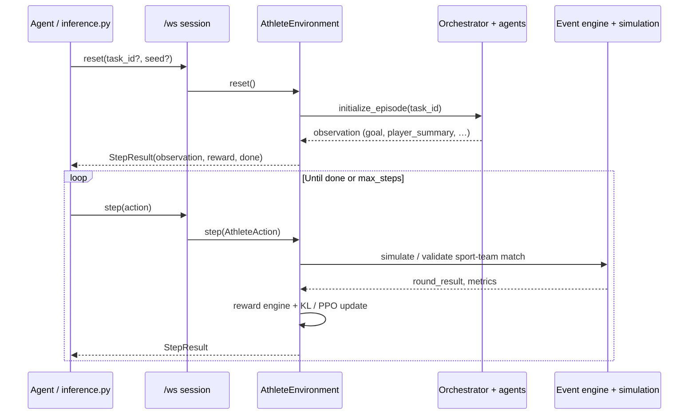

<p align="center">
  
</p>

# Fidenz Athlete OS — Multi-Sport Player Simulation Platform

An **OpenEnv-compliant reinforcement learning environment** that simulates professional athletes as living, memory-bearing AI personas. Recruitment teams, coaches, and analytics staff can upload seed data and run constrained RL simulations to predict future performance under any team or league context.

Supports **Soccer**, **Basketball**, and **Cricket** with sport-specific event engines, fatigue models, field visualizations, and cross-sport validation.

> **For a detailed explanation of all mathematics, algorithms, and architecture, see [`TECHNICAL_DEEP_DIVE.html`](TECHNICAL_DEEP_DIVE.html).**

---

## Environment Description & Motivation

Real-world sports recruitment is a high-stakes decision involving incomplete data, contextual nuance, and uncertain futures. Traditional scouting relies on static stat sheets. **Fidenz Athlete OS** bridges this gap by:

1. **Modeling athletes as behavioral personas** — a 16-dimensional trait vector (speed, stamina, creativity, pressure tolerance, etc.) captures a player's behavioral fingerprint.
2. **Simulating match performance** — a probabilistic event engine generates structured match events weighted by persona traits, opponent strength, fatigue, and home advantage. Events are sport-specific: goals/assists (soccer), points/rebounds (basketball), runs/wickets (cricket).
3. **Constraining persona drift** — a KL-divergence penalty ensures the RL policy doesn't warp the player's identity beyond plausible bounds.
4. **Building knowledge graphs** — an in-memory GraphRAG layer (replacing Neo4j/Zep Cloud) stores player-team-skill-match relationships for structured retrieval.
5. **Cross-sport validation** — the environment enforces sport-match constraints (e.g., a cricketer cannot be placed in a soccer team), returning actionable error messages.

This is not a toy or game — it models a genuine task that recruitment analysts actually perform, and provides a rich, multi-dimensional observation space for agent evaluation.

---

## Architecture

```
┌──────────────────────────────────────────────────────────┐
│                   OpenEnv API Layer                       │
│  WebSocket /ws ← primary (persistent session per client) │
│  POST /reset  →  Observation    POST /step  → Observation│
│  GET  /state  →  State          GET  /health → HealthResp│
└───────────────────┬─────────────────────────┬────────────┘
                    │                         │
            ┌───────▼───────┐         ┌───────▼───────┐
            │  Orchestrator  │◄───────►│  RL Engine    │
            │  (Swarm Router)│         │  PPO + KL     │
            └──┬──┬──┬──┬───┘         └───────────────┘
               │  │  │  │
   ┌───────┐ ┌▼┐┌▼┐┌▼┐┌▼───────┐
   │Ontology│ │P││S││G││ Report │
   │ Agent  │ │e││i││r││ Agent  │
   └────────┘ │r││m││a│└────────┘
              │s││R││d│
              │o││u││e│
              │n││n││r│
              │a││.││ │
              └─┘└─┘└─┘
                    │
            ┌───────▼───────┐
            │ In-Memory Graph│
            │ (Property Graph│
            │  + Vector Sim) │
            └────────────────┘
```

- **Multi-Agent Swarm**: Orchestrator routes actions to 6 specialized agents (Ontology, GraphBuilder, Persona, SimRunner, Grader, Report)
- **GraphRAG**: In-memory property graph with Player/Team/League/Skill/Match nodes, BFS traversal, and cosine vector similarity search
- **RL Engine**: PPO policy on a 16-dim persona trait vector with adaptive KL-divergence constraint to prevent persona drift
- **Simulation**: Sport-aware probabilistic event engine with trait-weighted sampling, fatigue model, and dual-context parallel simulation
- **WebSocket Sessions**: Each client connection gets an isolated environment instance via OpenEnv's `/ws` endpoint

---

## Technical implementation

### OpenEnv integration

The package follows the same layout as [reference OpenEnv environments](https://github.com/meta-pytorch/OpenEnv/tree/main/envs): a self-contained **`athlete_os_env/`** root with **`models.py`** (typed `Action` / `Observation` / `State`), **`client.py`** (subclass of `openenv.core.env_client.EnvClient`), **`server/`** (concrete `Environment` + FastAPI), and **`openenv.yaml`** (tasks, `max_steps`, declared env vars). The HTTP/WebSocket surface is produced by **`openenv.core.env_server.create_fastapi_app`**, which registers `/ws`, `/reset`, `/step`, `/state`, `/health`, and JSON-schema routes. Custom dashboard APIs live alongside in `server/app.py` and do not replace the OpenEnv contract. For full mathematical detail (reward sigmoid, KL schedule, graph algorithms), see **[`TECHNICAL_DEEP_DIVE.html`](TECHNICAL_DEEP_DIVE.html)**.

### Session and transport

| Transport | Use case |
|-----------|----------|
| **WebSocket `/ws`** | Primary path for agents and `inference.py`: one JSON-RPC-style message stream per session (`type`: `reset` \| `step` \| `state` \| `close`). Each connection gets a **dedicated `AthleteEnvironment` instance** so episodes do not leak across clients. |
| **HTTP `/reset`, `/step`** | Gym-style compatibility and smoke tests; same environment factory behind the SDK. |
| **WebSocket `/ws/live`** | Dashboard-only: optional real-time UI events (phase changes, rewards), separate from OpenEnv. |

The baseline client converts `http://` / `https://` base URLs to **`ws://` / `wss://`** and appends `/ws`, matching OpenEnv’s `EnvClient` behavior.

### Episode lifecycle (high level)



### Core server modules

| Area | Path | Responsibility |
|------|------|------------------|
| **Environment** | `server/athlete_environment.py` | `reset` / `step` / `state`; task selection; sport validation; wires orchestrator, RL, replay, logging. |
| **HTTP + static** | `server/app.py` | `create_fastapi_app`, CORS, static `server/static` (Vue build), custom REST + `/ws/live`. |
| **Swarm** | `server/agents/` | **Orchestrator** routes work; **Persona**, **SimRunner**, **Grader**, **Report**, **Ontology**, **GraphBuilder** implement domain steps. |
| **GraphRAG** | `server/graphrag/` | In-memory property graph, ontology helpers, **retriever** (BFS + vector similarity). |
| **RL** | `server/rl/` | **PPO** on persona logits, **KL constraint**, **reward** shaping, **experience replay** for advantage estimates. |
| **Simulation** | `server/simulation/` | Sport-specific **event engine**, **fatigue**, **simulation_manager** / **simulation_runner** (including dual-context paths). |
| **Data** | `server/utils/sports_data.py` | Sample players, teams, compatibility helpers for validation and demos. |

### Simulation and reward (runtime path)

1. **Action validation** — e.g. player sport vs target team sport; failures surface in `observation.last_action_error` without crashing the episode.
2. **Event generation** — discrete events sampled from persona-weighted distributions; different **event vocabularies** per sport (see Multi-Sport table).
3. **Metrics** — aggregates (tactical fit, output, etc.) feed the shaped reward and grader-facing state.
4. **RL update** — transitions stored in replay; PPO-style update on the persona vector with **KL penalty** vs baseline to limit drift.

### Frontend and assets

The UI is a **Vue 3 + Vite** SPA under `frontend/`. Production builds emit to `frontend/dist/` and are copied into **`server/static/`** at image build time so FastAPI serves a single origin (no separate CDN). API calls use the same host; OpenEnv sessions use **`/ws`** from the browser via the shared client patterns in `frontend/src/api/`.

### Container image

The **`Dockerfile`** uses a **single** `python:3.11-slim` base: Node/npm from Debian install the frontend, `npm ci && npm run build`, then the tree is copied and `dist` is moved to `server/static`. Python dependencies are installed via **`requirements.txt`**. This avoids pulling a second base image (`node:…`) from Docker Hub, which often breaks automated builds behind restrictive networks. **Port `7860`** is the default for Hugging Face Spaces (`PORT` env).

### Resource expectations

Evaluation targets **2 vCPU / 8 GB RAM**. The stack is CPU-first (NumPy, no GPU training loop); avoid loading huge models inside the **server** process—LLM calls belong in **`inference.py`** with `API_BASE_URL` / `MODEL_NAME` / `HF_TOKEN`.

---

## Multi-Sport Support

| Sport | Events | Match Length | Stat Metrics | Field Visualization |
|-------|--------|-------------|--------------|---------------------|
| **Soccer** | pass, shot, dribble, tackle, foul, goal, assist | 90 min | Goals, Assists, Rating | Pitch (SVG) |
| **Basketball** | two_pointer, three_pointer, free_throw, rebound, assist, steal, block, turnover | 48 min | Points, Assists, Rebounds | Court (SVG) |
| **Cricket** | single, double, four, six, dot_ball, wicket, catch, run_out | 300 balls | Runs, Wickets, Strike Rate | Field (SVG) |

The environment validates sport-team compatibility at every step. Attempting to simulate a cricketer in a soccer team returns an actionable error.

**Cricket dataset:** [`archive.zip`](https://github.com/beprith/Fidenz-Athlete-OS/blob/main/archive.zip) at the root of **Fidenz-Athlete-OS** (`Fidenz-Athlete-OS/archive.zip` in a repo checkout) contains sample cricket data for ingest and simulation workflows.

---

## Action Space

```python
class AthleteAction(openenv.Action):
    action_type: str    # "simulate_round" | "query_persona" | "adjust_params"
    player_id: str      # Target player identifier
    target_context: dict # {"team": "Arsenal", "formation": "4-3-3", "role": "CF"}
    sim_params: dict     # {"opponent_strength": 0.7, "home_away": "away"}
    query: str           # Natural language query (for query_persona)
```

| Action Type | Description | Typical Use |
|-------------|-------------|-------------|
| `simulate_round` | Run one match simulation round | Core loop: observe → simulate → learn |
| `query_persona` | Retrieve persona info + graph context | Information gathering before simulation |
| `adjust_params` | Update simulation parameters | Tuning opponent strength, formation |

---

## Observation Space

```python
class AthleteObservation(openenv.Observation):
    # Inherited: done (bool), reward (float), metadata (dict)
    goal: str                        # Current task objective
    player_summary: str              # Player name + stats from last round
    round_result: dict               # {"goals": 1, "assists": 0, "rating": 7.2, "events": [...]}
    performance_metrics: dict        # {"tactical_fit": 0.72, "output_score": 0.65, ...}
    persona_drift_score: float       # KL divergence penalty from baseline
    last_action_error: str | None    # Error message (e.g., sport mismatch) or None
    graph_context: str               # Structured graph traversal + memory context
    step_hint: str                   # Reward-based hint for the agent
```

The observation provides rich signal at every step: raw match events, aggregated metrics, persona drift, graph context, and an adaptive hint.

---

## Tasks

| # | Task | Difficulty | Max Steps | Grader Description |
|---|------|-----------|-----------|---------------------|
| 1 | **Single Player Stat Prediction** | Easy | 10 | Binary prediction (above/below career mean) + confidence calibration + reasoning quality |
| 2 | **Player-Team Tactical Fit** | Medium | 20 | 5-round simulation scored on output plausibility (40%), tactical alignment (40%), narrative coherence (20%) |
| 3 | **Full Squad Recruitment Sim** | Hard | 50 | 10-match season for 11 players scored on squad output (30%), rotation (25%), injury management (20%), tactical evolution (15%), individual development (10%) |

All graders are **deterministic** and map scores into **(0, 1)** (strictly; endpoints are avoided for submission validators). Task difficulty genuinely escalates — Task 3 challenges even frontier models with multi-player optimization over a season-length horizon.

---

## Reward Function

The reward provides **partial credit per step** (not just sparse terminal feedback):

```
R_shaped = σ(0.40·output + 0.30·tactical + 0.20·coherence + 0.10·efficiency + penalties)
r_t = max(0, R_shaped − β·KL(π_current || π_baseline))
```

- **Bounded sigmoid** σ(x) with steepness=6.0, midpoint=0.5 → output always in [0, 1]
- **Hallucination penalty** (−0.3) for implausible stats
- **Repeat penalty** (−0.2) for 3+ consecutive identical actions
- **KL-divergence penalty** with adaptive β (grows when drift > 0.3, shrinks when < 0.05)

---

## Environment Variables

| Variable | Description | Required |
|----------|-------------|----------|
| `API_BASE_URL` | LLM API endpoint (OpenAI-compatible) | Yes (for inference) |
| `MODEL_NAME` | Model identifier for inference | Yes (for inference) |
| `HF_TOKEN` | Hugging Face / API authentication key | Yes (for inference) |
| `IMAGE_NAME` | Docker image name (used by evaluator's `from_docker_image()`) | Optional |
| `ENV_BASE_URL` | Environment server URL (default: `http://localhost:7860`) | Optional |
| `WORKERS` | Uvicorn worker count (default: `1`) | Optional |
| `MAX_CONCURRENT_ENVS` | Max WebSocket sessions per worker (default: `100`) | Optional |

The server runs without LLM keys — the environment simulation is self-contained. **`inference.py` requires `HF_TOKEN`** (Meta OpenEnv Hackathon rule); it uses the OpenAI client with `API_BASE_URL` and `MODEL_NAME` (both have defaults).

---

## Setup

### Local Development

```bash
cd athlete_os_env
python -m venv venv && source venv/bin/activate
pip install -r requirements.txt

# Start server
PYTHONPATH=. uvicorn server.app:app --port 7860

# Or use the entry point
PYTHONPATH=. python -m server.app
```

### Frontend Development

```bash
cd frontend
npm install
npm run dev      # Dev server with HMR
npm run build    # Production build → dist/
```

### Docker

```bash
docker build -t fidenz-athlete-os .
docker run -p 7860:7860 \
  -e API_BASE_URL=https://api.openai.com/v1 \
  -e MODEL_NAME=gpt-4o-mini \
  -e HF_TOKEN=your_token \
  fidenz-athlete-os
```

### Run Baseline Inference

```bash
# With a running server (WebSocket connection)
ENV_BASE_URL=http://localhost:7860 \
API_BASE_URL=https://api.openai.com/v1 \
MODEL_NAME=gpt-4o-mini \
HF_TOKEN=your_token \
python inference.py

# With Docker image (used by evaluators)
IMAGE_NAME=fidenz-athlete-os \
API_BASE_URL=https://api.openai.com/v1 \
MODEL_NAME=gpt-4o-mini \
HF_TOKEN=your_token \
python inference.py
```

### Inference Output Format

The script emits mandatory structured stdout logs:

```
[START] task=single_player_stat_prediction env=fidenz_athlete_os model=gpt-4o-mini
[STEP] step=1 action={"action_type":"simulate_round",...} reward=0.72 done=false error=null
[STEP] step=2 action={"action_type":"simulate_round",...} reward=0.45 done=false error=null
...
[END] success=true steps=10 rewards=0.72,0.45,...
```

---

## API Endpoints

### OpenEnv Standard (auto-registered via SDK)

| Endpoint | Method | Description |
|----------|--------|-------------|
| `/ws` | WebSocket | **Primary** — persistent session per connection (used on HF Spaces) |
| `/reset` | POST | Initialize new episode; body: `{seed?, episode_id?}` |
| `/step` | POST | Execute one step; body: `{action: {...}}` |
| `/state` | GET | Current episode state |
| `/health` | GET | Health check → `{status: "healthy"}` |
| `/schema/*` | GET | JSON schemas for action, observation, and state models |
| `/metadata` | GET | Environment name, description, version |

### Custom Extensions (Dashboard)

| Endpoint | Method | Description |
|----------|--------|-------------|
| `/api/set-task` | POST | Pre-select task for next reset: `{task_id: "..."}` |
| `/api/tasks` | GET | List available tasks with difficulty and max_steps |
| `/api/players` | GET | List all sample player profiles |
| `/api/teams?sport=` | GET | List teams, optionally filtered by sport |
| `/api/compatible-teams/{player_id}` | GET | Teams matching a player's sport |
| `/api/graph` | GET | Current knowledge graph (nodes + edges) |
| `/api/report` | GET | Generate scouting report for active episode |
| `/api/upload` | POST | Upload CSV/JSON data file |
| `/ws/live` | WebSocket | Real-time dashboard event stream |

---

## Baseline Scores

Approximate scores from `inference.py` when the model returns invalid JSON or requests fail (fallback action); with a working LLM, scores are typically higher:

| Task | Score | Steps |
|------|-------|-------|
| Single Player Stat Prediction | ~0.45 | 10 |
| Player-Team Tactical Fit | ~0.39 | 20 |
| Full Squad Recruitment Sim | ~0.34 | 50 |
| **Average** | **~0.39** | |

With a capable LLM (GPT-4o, Qwen-72B), expect scores 20–40% higher due to intelligent action selection and tactical adaptation.

---

## Project Structure

```
athlete_os_env/
├── assets/
│   └── fidenz-labs-logo.png  # Brand logo (README + reference)
├── inference.py              # Baseline inference (async, WebSocket, [START]/[STEP]/[END])
├── client.py                 # WebSocket client (inherits openenv.EnvClient)
├── models.py                 # Pydantic models (Action, Observation, State, Persona)
├── openenv.yaml              # OpenEnv manifest (3 tasks, env vars)
├── pyproject.toml            # Project metadata + [project.scripts] server entry
├── requirements.txt          # Python dependencies (includes openenv-core)
├── Dockerfile                # Single-stage: python:3.11-slim + Node (npm) for frontend build
├── docker-compose.yml        # Local dev compose
├── .env.example              # Template for env vars
├── .gitignore
├── TECHNICAL_DEEP_DIVE.html  # Detailed math & architecture explanation
├── README.md                 # This file
├── server/
│   ├── app.py                # FastAPI server (create_fastapi_app + custom routes)
│   ├── athlete_environment.py # Core OpenEnv Environment (reset/step/state)
│   ├── agents/               # Swarm agents (orchestrator, persona, grader, etc.)
│   ├── graphrag/             # In-memory property graph + retriever + ontology
│   ├── rl/                   # PPO policy, KL constraint, reward engine, replay buffer
│   ├── simulation/           # Sport-aware event engine, fatigue model, dual-context runner
│   ├── utils/                # LLM client, sports data, logger, retry
│   └── static/               # Built Vue frontend (served by FastAPI)
└── frontend/
    ├── public/
    │   └── fidenz-labs-logo.png  # Served at /fidenz-labs-logo.png in the app
    ├── src/
    │   ├── views/            # Home, Workspace, SimulationRun, Squad, Report
    │   ├── components/       # PlayerCard, PitchView, RewardChart, SwarmStatusBar, etc.
    │   ├── store/            # Pinia stores (episode, squad, simulation)
    │   ├── api/              # Axios HTTP client + WebSocket composable
    │   └── router/           # Vue Router
    ├── package.json
    └── vite.config.js
```

---

## Tech Stack

| Layer | Technology |
|-------|-----------|
| **Backend** | Python 3.11, FastAPI, OpenEnv-core, NumPy |
| **RL Engine** | PPO (logit-space, no neural network) + KL Constraint + GAE |
| **Knowledge** | In-memory property graph + cosine vector similarity |
| **Frontend** | Vue 3, Vite, Tailwind CSS, D3.js, Chart.js, Pinia |
| **Client** | OpenEnv `EnvClient` (WebSocket), supports `from_docker_image()` |
| **Inference** | OpenAI client, async, structured `[START]/[STEP]/[END]` stdout |
| **Deploy** | Docker (single base image), Hugging Face Spaces (`PORT` / 7860) |

---

## Validation

```bash
# Pre-submission validation
openenv validate
# → [OK] athlete_os: Ready for multi-mode deployment

# Docker build
docker build -t fidenz-athlete-os .

# Smoke test (HTTP)
curl -X POST http://localhost:7860/reset -d '{}' -H 'Content-Type: application/json'

# Smoke test (WebSocket via Python)
python -c "
import asyncio
from client import AthleteOSEnv
async def test():
    async with AthleteOSEnv(base_url='http://localhost:7860') as env:
        r = await env.reset()
        print('Goal:', r.observation.goal)
        r = await env.step({'action_type': 'simulate_round', 'player_id': 'default', 'target_context': {}})
        print('Reward:', r.reward, 'Done:', r.done)
asyncio.run(test())
"
```

---

*Built by Fidenz Labs for the OpenEnv Hackathon.*
